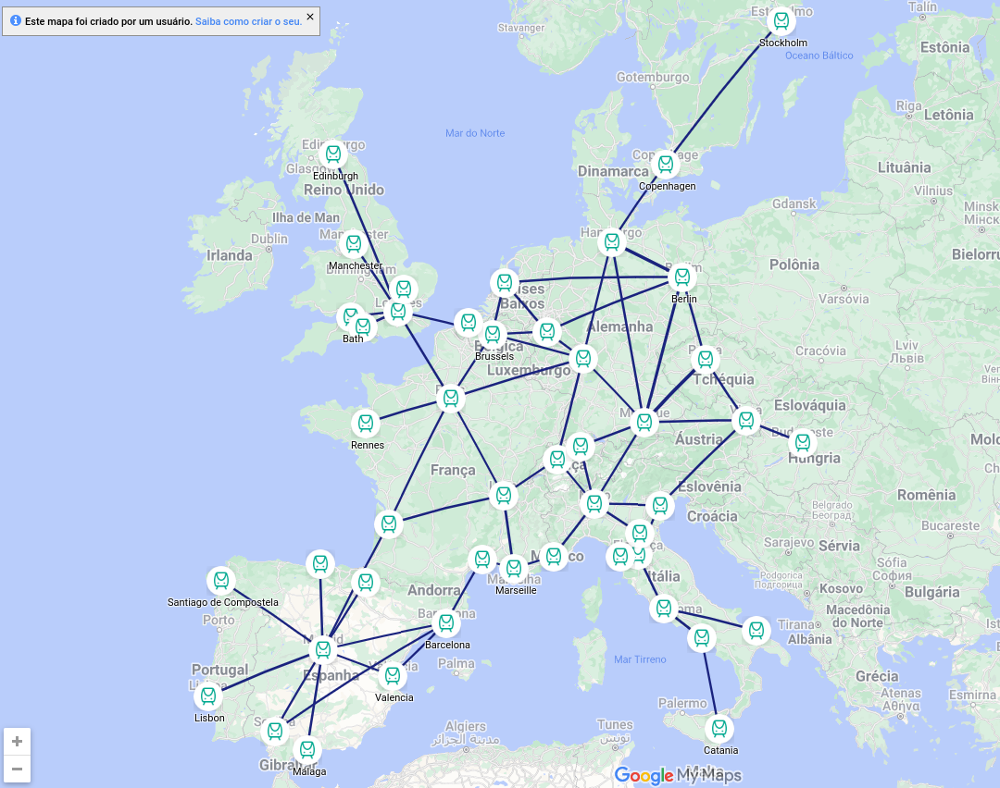
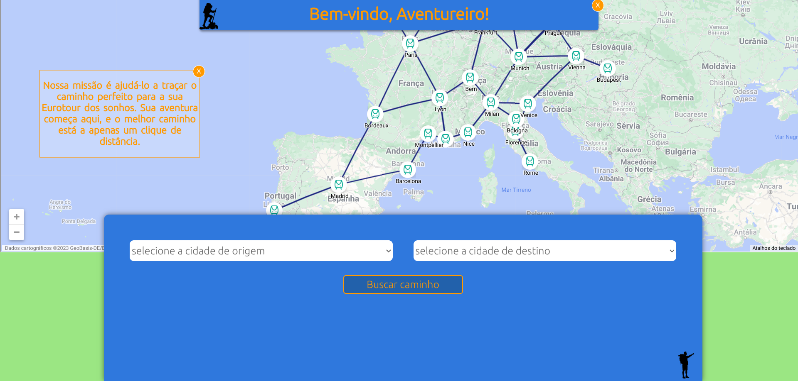
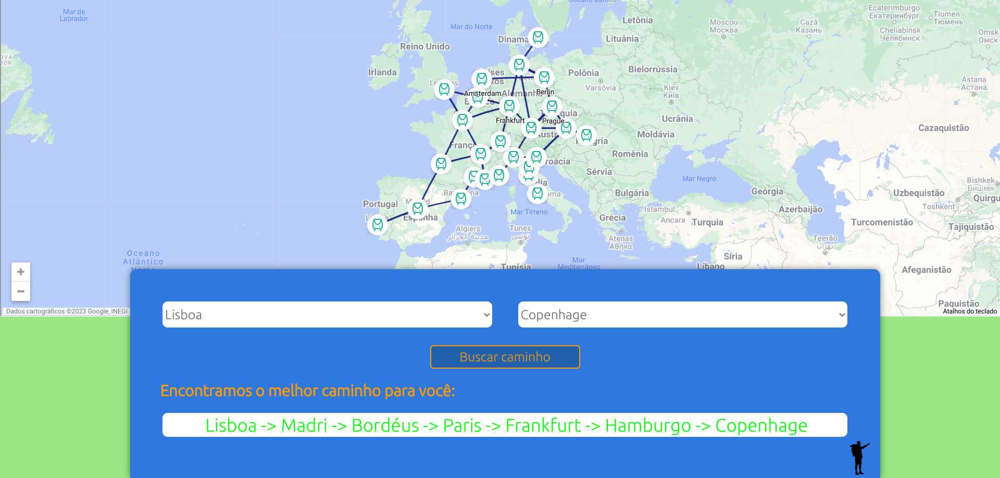

# O Mochileiro

**Conteúdo da Disciplina**: Grafos 1<br>

## Alunos
|Matrícula | Aluno |
| -- | -- |
| 20/0018442  |  Gabrielly Assunção Rodrigues |
| 20/0023934|  Maria Eduarda Barbosa Santos |

### Apresentação

<iframe src="https://unbbr-my.sharepoint.com/personal/200018442_aluno_unb_br/_layouts/15/embed.aspx?UniqueId=a676bef9-f5e7-473f-9eb4-c7122a810940&nav=%7B%22playbackOptions%22%3A%7B%22startTimeInSeconds%22%3A0%7D%7D&embed=%7B%22ust%22%3Atrue%2C%22hv%22%3A%22CopyEmbedCode%22%7D&referrer=StreamWebApp&referrerScenario=EmbedDialog.Create" width="640" height="360" frameborder="0" scrolling="no" allowfullscreen title="projeto de algoritmos-20230925_201230-Meeting Recording.mp4"></iframe>

## Sobre 

<p align="justify">
Seja bem-vindo ao 'Mochileiro'! Aqui, vamos facilitar a sua aventura pela Europa, seja você um mochileiro experiente ou apenas alguém com vontade de viajar pelo continente.
Com 'Mochileiro', você poderá descobrir as rotas de trem pela Europa de maneira descomplicada. Imagine ter a liberdade de escolher de onde começar sua jornada e o seu destino final. E não se preocupe, encontraremos o caminho mais curto para você, utilizando as fantásticas linhas ferroviárias da Europa.
Então, prepare-se para uma emocionante viagem e vamos juntos explorar as maravilhas da Europa de trem!"</p>

<p align="justify">
Você pode acessar as passagens desses trens clicando no ícone de trem, que o direcionará para o site <a href="https://www.thetrainline.com/pt-br">the Trainline</a> onde também foi baseado o mapa utilizado no projeto.
</p>


## Screenshots
**Imagem 1 - Mapa Original** 



**Imagem 2 - Tela inicial** 



**Imagem 3 - Resultado** 



## Instalação 
**Linguagem**: JavaScript<br>
**Framework**: Node.js React.js<br>
### Pré-requisitos para rodar o sistema:

- Node.js versão v14.0.0 ou superior <br>
#### Passo 1
- Após a instação de todos os pŕe-requisitos, dentro da pasta backpacker utilize o comando:
  ```
  npm start
  ```


 ### Pronto, o projeto estará rodando! 
## Uso 

<p align="justify">
Nosso mapa exibe as rotas de trem em várias cidades da Europa. Tudo o que você precisa fazer é escolher o ponto de partida e o destino desejados, e nossa aplicação encontrará o caminho mais curto entre essas cidades. É fácil e conveniente para planejar suas viagens de trem pela Europa.
</p>

## Outros 

Vale ressaltar que os responsáveis pelo desenvolvimento do projeto **O Mochileiro** não se responsabilizam por qualquer coisa que possa ocorrer com os usuários ao utilizarem o site [the Trainline](https://www.thetrainline.com/pt-br).  
