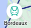

# O Mochileiro

**Conteúdo da Disciplina**: Grafos 1<br>

## Alunos
|Matrícula | Aluno |
| -- | -- |
| 20/0018442  |  Gabrielly Assunção Rodrigues |
| 20/0023934|  Maria Eduarda Barbosa Santos |

## Sobre 

O projeto é chamado mochileiro, a ideia é facilitar a um mochileiro (ou qualquer pessoa interessada em viajar pela Europa) a usar o transporte para viajar por várias cidades em países diferentes da Europa. O transporte em específico é o trem, cujo projeto é demonstrar não só as rotas de trens da europa de forma mais simplificada, mas também as opções de escolher a origem de partida da viagem do mochileiro e o destino, resultando no menor caminho que é preciso percorrer utilizando as linhas de trens da Europa até atingir o seu destino.

Também é possível acessar as passagens destes trens, pois clicando no **ícone De Trem** vai direcioná-lo até o site [the trainline](https://www.thetrainline.com/pt-br). 

**Imagem1 - ícone De Trem** 



Esse site possui as passagens dos trens para você conseguir comprar de forma online. Deixando o projeto não só dinâmico, mas também facilitando ainda mais a realização da viagem do mochileiro. 

O mapa utilizado no projeto foi baseado no mapa disponibilizado pelo site **the trainline**. Foi preciso fazer uma simplificação do mapa original de modo que não deixasse de ser válido e real. Antes eram 42 cidades com a mudança resultou em 26 cidades no mapa simplificado.

O mapa original se encontra em [Trainline.com](https://www.google.com/maps/d/viewer?mid=1C32UlQDhOUDvGSwp5b5vvmor7RN4wuQs&femb=1&ll=47.67500830393339%2C9.644235769772656&z=5), podendo ser visualizado em **Imagem2**. 

**Imagem2 - Mapa Original** 


## Screenshots
Adicione 3 ou mais screenshots do projeto em funcionamento.

## Instalação 
**Linguagem**: JavaScript e CSS <br>
**Framework**: NodeJs<br>

### Pré-requisitos para rodar o sistema:

- NodeJs na versão v14.13.0
- npm v6.14.8
- CSS
- React

## Uso 
### Passo 1:

- Após intalar as tecnologias que são Pré-requisitos, Clona o repositório do projeto em sua máquina. Com o comando logo abaixo:
  ```
  git clone https://github.com/projeto-de-algoritmos/Grafos1_O_Mochileiro.git
  ```
### Passo 2:
- Abre a pasta backpacker pelo terminal e digita:
  ```
  npm start
  ```
 ### Pronto, o projeto estará rodando! 

## Outros 

Vale ressaltar que os responsáveis pelo desenvolvimento do projeto **O Mochileiro** não se responsabilizam por qualquer coisa que possa ocorrer com os usuários ao utilizarem o site [the trainline](https://www.thetrainline.com/pt-br).  
